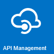

# Azure API Management - Hands-on Lab Workshop

This hands-on-lab will guide you through the different concepts around Azure API Management, from the creation, to the DevOps, including good practices in terms of versioning, security and so on.

Index

- [Part 1 - Create an API Management instance](apimanagement-1.md)
- [Part 2 - Developer Portal and Product Management](apimanagement-2.md)
- [Part 3 - Adding API's](apimanagement-3.md)
- [Part 4 - Caching and Policy Expressions](apimanagement-4.md)
- [Part 5 - Versioning and Revisions](apimanagement-5.md)
- [Part 6 - Analytics and Monitoring](apimanagement-6.md)
- [Part 7 - Security](apimanagement-7.md)
- [Part 8 - DevOps](apimanagement-8.md)

Additional Topics

- [Provision your own instance of ColorWeb/ColorAPI](apimanagement-A.md)
- [API Proxy to Serverless](apimanagement-B.md)
- [Self-hosted Gateway](apimanagement-C.md)
- [AAD - Integration, Work In progress](apimanagement-D.md) 

Slides

- [Azure API Management Slides](/slides/APIM.pptx)

Authors

- [Mark Harrison](http://github.com/markharrison)
- [David Barkol](https://github.com/dbarkol)
- [Osvaldo Dailbert](https://github.com/odaibert)
- [Fernando Mejía](https://github.com/feranto)
- [Louis-Guillaume MORAND](https://github.com/lgmorand)

[Based on the original APIM Lab by Mark Harrison.](https://github.com/markharrison/Lab_APIM_Original)

Last Updated: 24/Aug/2020

---
