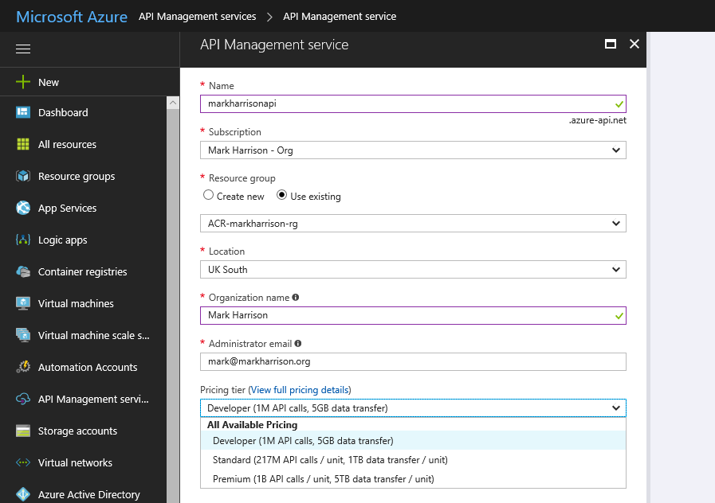
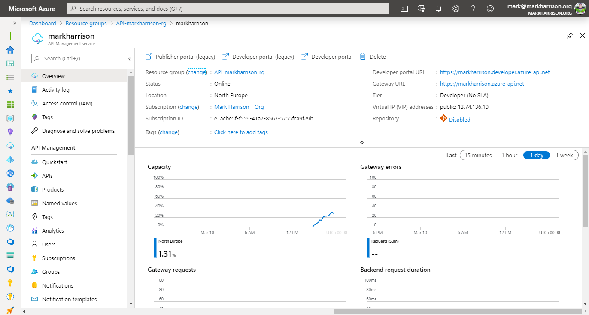

# API Management - Hands-on Lab Script - part 1

- Part 1 - Create an API Management instance (You are here)
- [Part 2 - Developer Portal and Product Management](apimanagement-2.md)
- [Part 3 - Adding API's](apimanagement-3.md)
- [Part 4 - Caching and Policy Expressions](apimanagement-4.md)
- [Part 5 - Versioning and Revisions](apimanagement-5.md)
- [Part 6 - Analytics and Monitoring](apimanagement-6.md)
- [Part 7 - Security](apimanagement-7.md)
- [Part 8 - DevOps](apimanagement-8.md)

## Create an API Management instance

An instance can take sometime to provision - so have one created in advance of any demo.

Use appropriate values and hit [Create] to provision the service.

- The service name must be unique.
- For demo purposes, use the Developer tier.

Once the service has been provisioned, there will be:

- Publisher Administration - (now located in the Azure Management Portal - the older Publisher portal has now been deprecated)
- Developer portal
- Gateway

The link to the developer portal is at the top of the Overview blade.

---
[Home](README.md) | [Next](apimanagement-2.md)
