# API Management - Hands-on Lab Script - part 2

Mark Harrison : checked & updated 12 March 2020 - original 1 Nov 2017

- [Part 1 - Create an API Management instance](apimanagement-1.md)
- [Part 2 - Developer Portal](apimanagement-2.md) ... this document
- [Part 3 - Administration](apimanagement-3.md)
- [Part 4 - Policy Expressions](apimanagement-4.md)
- [Part 5 - API Proxy to other Azure services](apimanagement-5.md)

## Developer Portal

Developer portal is located at: {apim-service-name}.developer.azure-api.net

Accessing from link in the Overview blade of the Azure Management Portal, will display the developer portal in admin / edit mode
Using the Operations Icon - select `Publish Website`.  It will then be available for users to access.

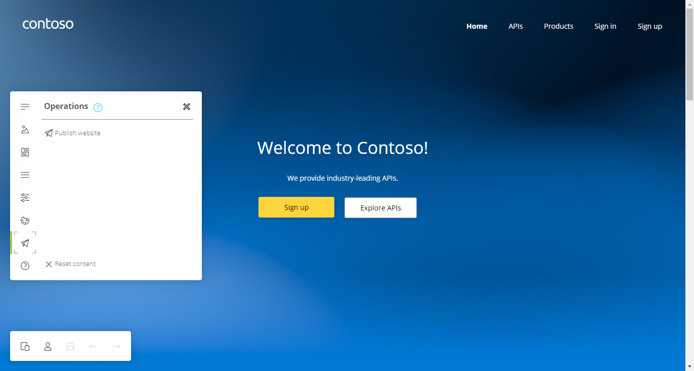

### User Experience

#### Anoymous User

- As an unauthenticated user, look around the developer portal
- Check the Products
  - Notice the difference between the Starter & Unlimited products
- Check the APIs

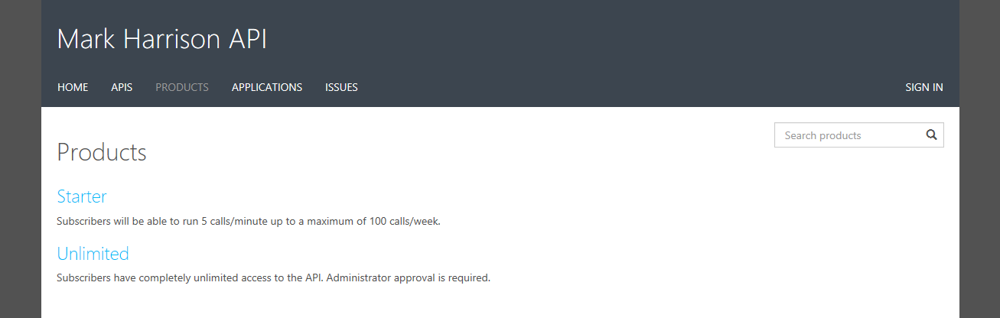

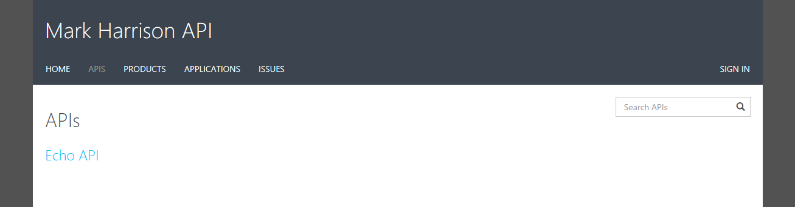

#### Register for an account

- If logged in as Administrator - log out
- Sign up for an account

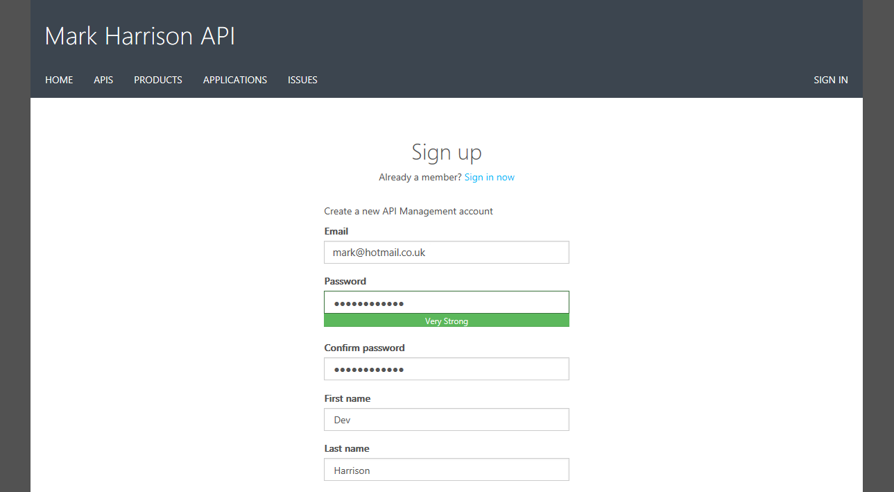

- Check acceptance email and confirm to activate account

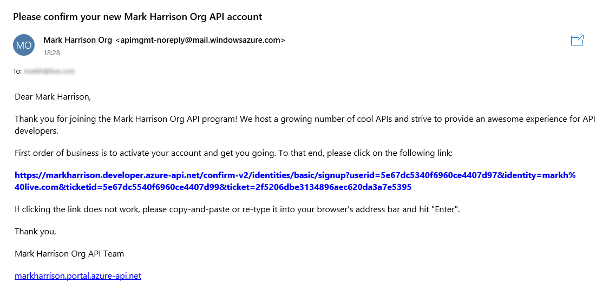

- Sign into account

- Select Unlimited Product - Subscribe to a "Unlimited" subscription
  - Check email - needs approval
- Select Starter Product - Subscribe to a "Starter" subscription
  - Check email - accepted

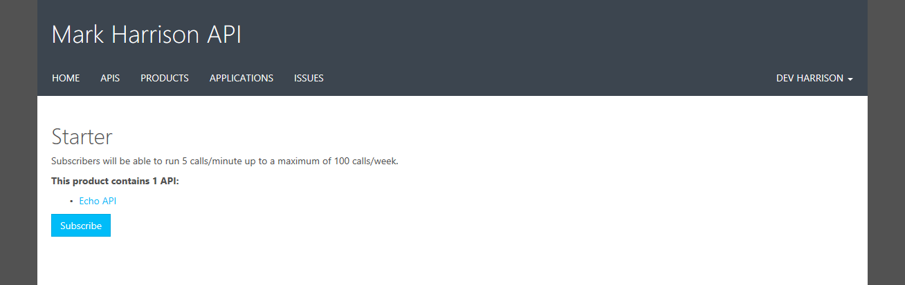

- Check user profile - see products and keys
  - Note that the Unlimited subscription is not yet Active as this request has not yet been approved

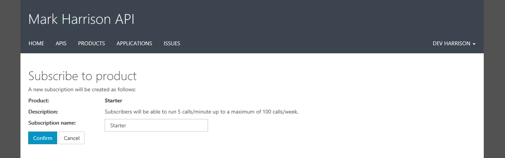

#### Try an API

- Look at the Echo API
  - Notice the developer information
  - Test the Echo API ... there may be a CORS error - we will address that later.

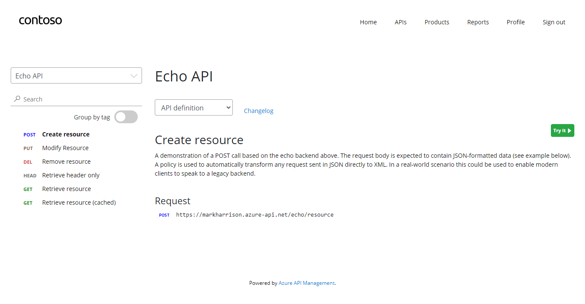

### Customising the Developer Portal

#### Site Configuration

The developer portal is based on a fork of the Paperbits web framework <https://paperbits.io/>, and is enriched with API Management-specific features.  The fork resides at <https://github.com/Azure/api-management-developer-portal>.

It is possible to self-host, and manage your own developer portal outside of an API Management instance. It's an advanced option, which allows you to edit the portal's codebase and extend the provided core functionality. This is documented at <https://github.com/Azure/api-management-developer-portal/wiki>/ and <https://docs.microsoft.com/en-us/azure/api-management/api-management-howto-developer-portal>.

Before you make your portal available to the visitors, you should personalize the automatically generated content. Recommended changes include the layouts, styles, and the content of the home page. This is documented at <https://docs.microsoft.com/en-us/azure/api-management/api-management-howto-developer-portal-customize>

Video on customisation is at <https://www.youtube.com/watch?v=5mMtUSmfUlw>

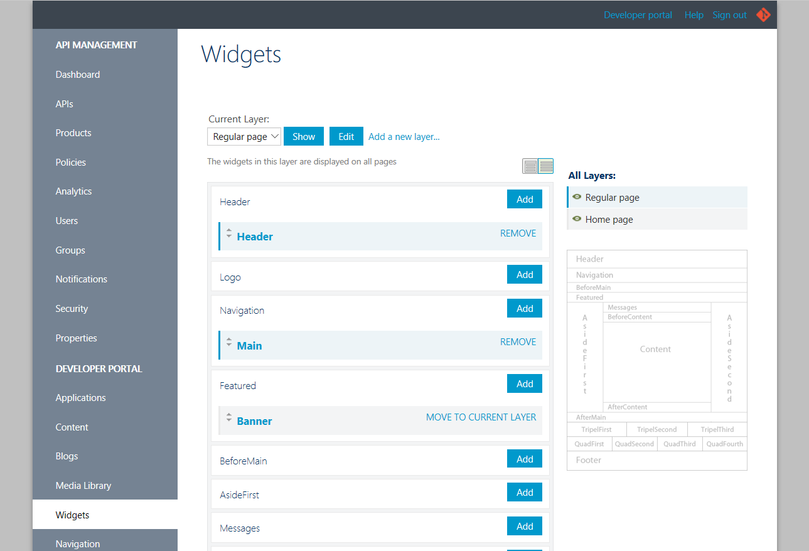

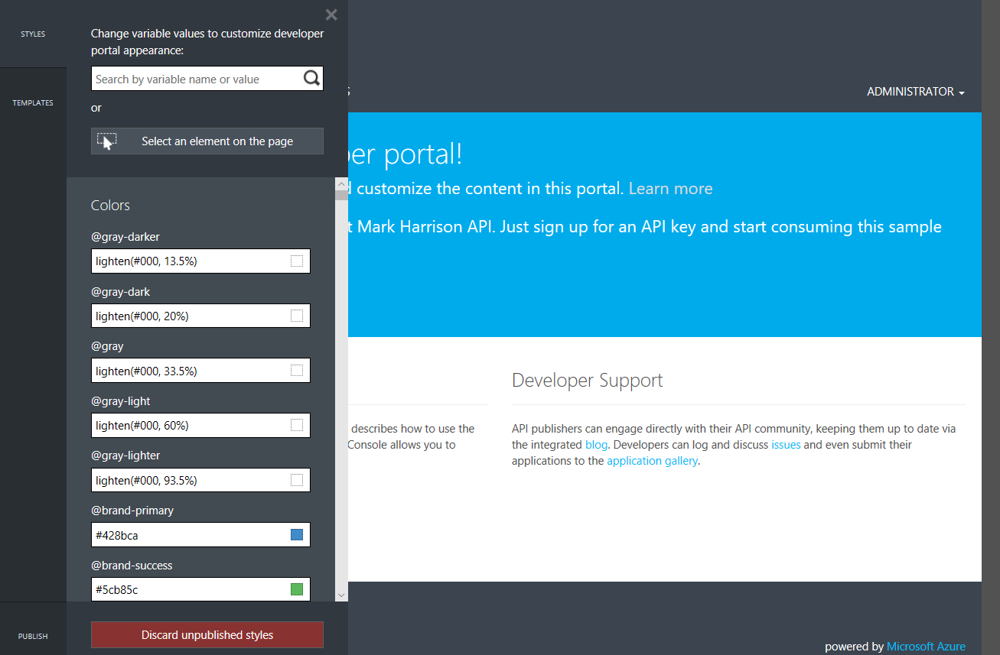

#### Email Configuration

The templates for the email notifications are managed from the Azure Management Portal

- Look at notifications
- Look at email templates

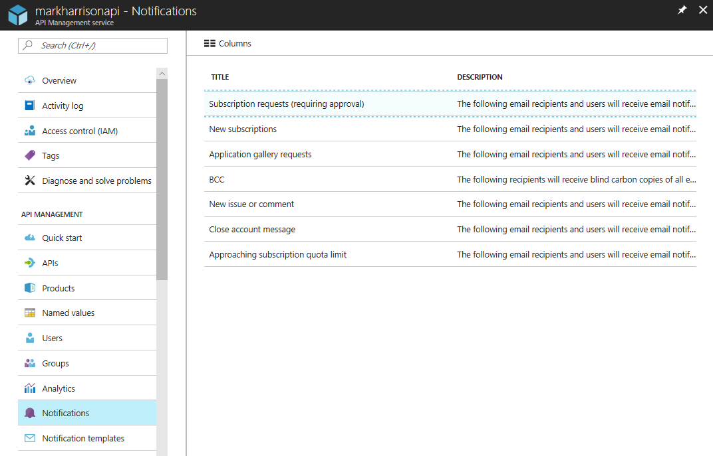

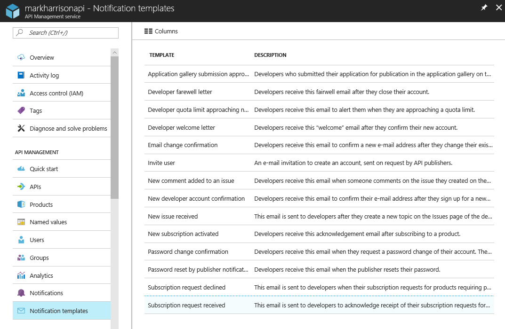

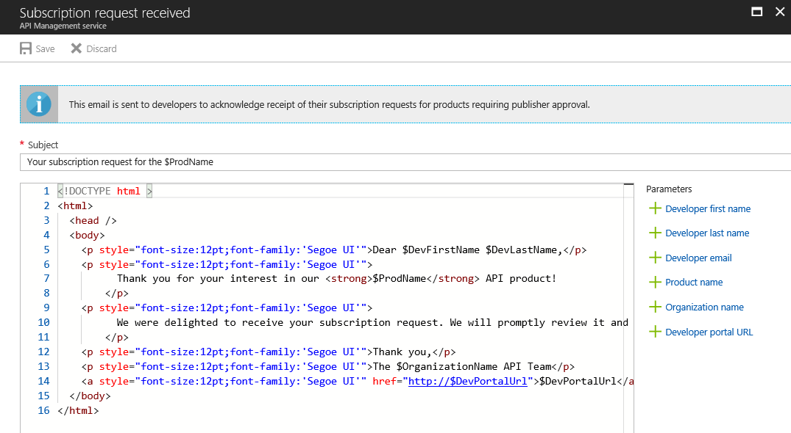

---
[Home](apimanagement-0.md) | [Prev](apimanagement-1.md) | [Next](apimanagement-3.md)
