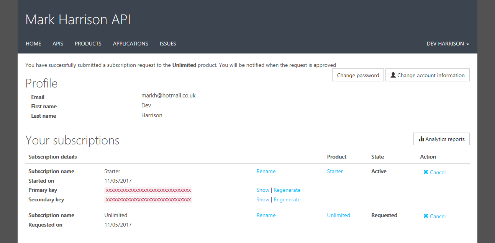

# API Management - Hands-on Lab Script - part 2

Mark Harrison : 1 Nov 2017

- [Part 1 - Create an API Management instance](apimanagement-1.md) 
- [Part 2 - Developer Portal](apimanagement-2.md) ... this document
- [Part 3 - Administration](apimanagement-3.md)
- [Part 4 - Policy Expressions](apimanagement-4.md)
- [Part 5 - API Proxy to other Azure services](apimanagement-5.md)

## Developer Portal

Developer portal is located at: {apim-service-name}.portal.azure-api.net

### User Experience

#### Anoymous User

- Look around the developer portal
- Products
  - Notice the difference between the Starter & Unlimited products
- APIs

#### Register for an account

- If logged in as Administrator - log out
- Sign up for an account
  - Check acceptance email and confirm to activate account

- Signup for "Unlimited" subscription
  - Check email - needs approval
- Signup for "Starter" subscription
  - Check email - accepted

- Check user profile - see products and keys

#### Try an API

- Look at the Echo API
  - Notice the developer information
  - Test the Echo API

### Customising the Developer Portal

#### Site Configuration

The developer portal is based on the Orchard CMS <http://www.orchardproject.net/> and <http://dotliquidmarkup.org/>.  Configuration is made in both the Publishing portal and Developer Portal (when logged in as an administrator)

- Look at site configuration options
  - Content
  - Widgets | Edit ... see the Orchard foundation
  - Navigation
  - Styles

#### Email Configuration

- Look at notifications
- Look at email templates

---
[Home](apimanagement-0.md) | [Prev](apimanagement-1.md) | [Next](apimanagement-3.md)