# API Management - Hands-on Lab Script - part 3

Mark Harrison : 1 Nov 2017

- [Part 1 - Create an API Management instance](apimanagement-1.md)
- [Part 2 - Developer Portal](apimanagement-2.md)
- [Part 3 - Administration](apimanagement-3.md)  ... this document
- [Part 4 - Policy Expressions](apimanagement-4.md)
- [Part 5 - API Proxy to other Azure services](apimanagement-5.md)

## Administration

### Identity

#### Users / Groups

- Look at users and groups

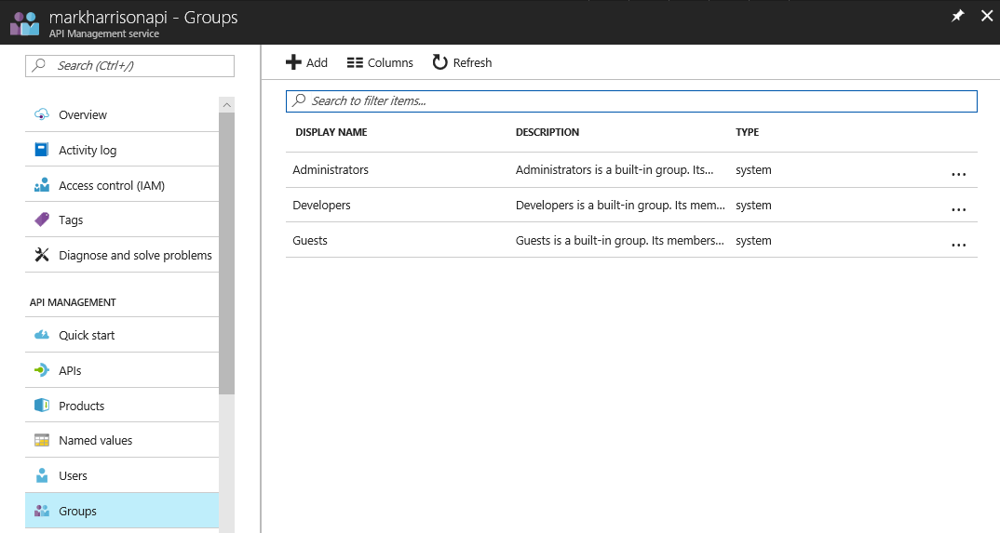

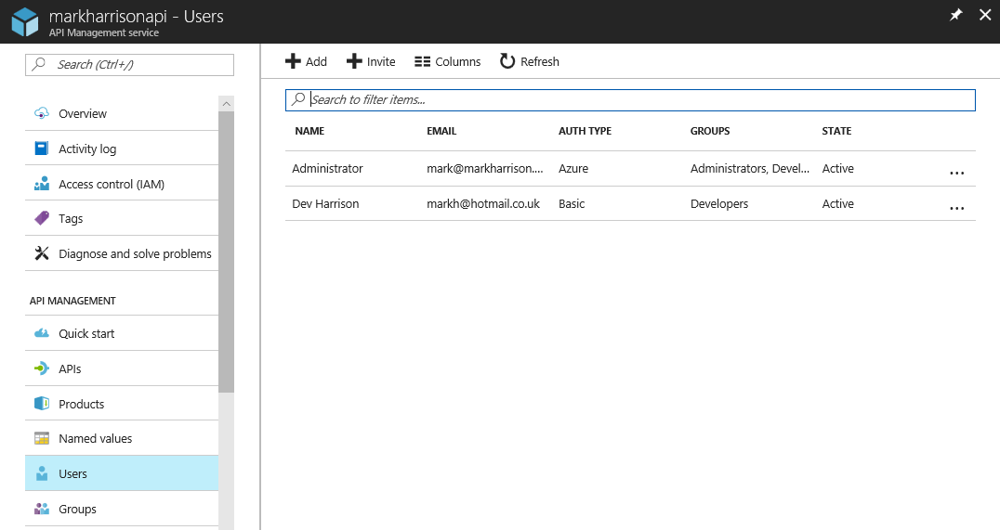

- Approve the developers request (from earlier) for a "Unlimited" subscription

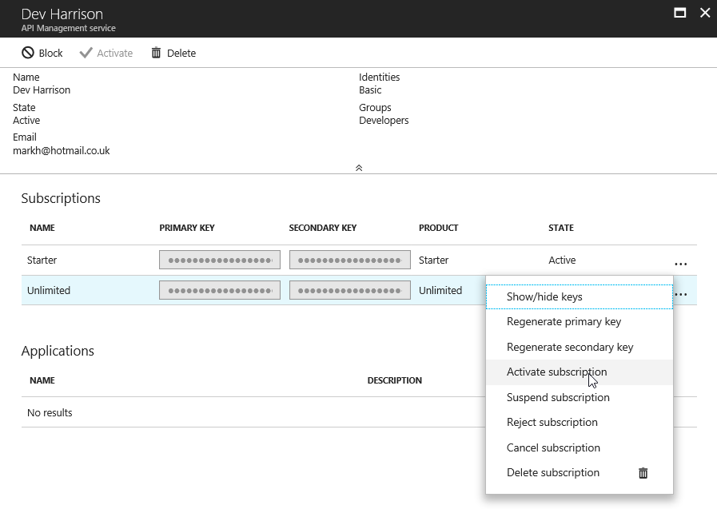

#### Federation

User identity can federate with Azure AD and social identity providers.

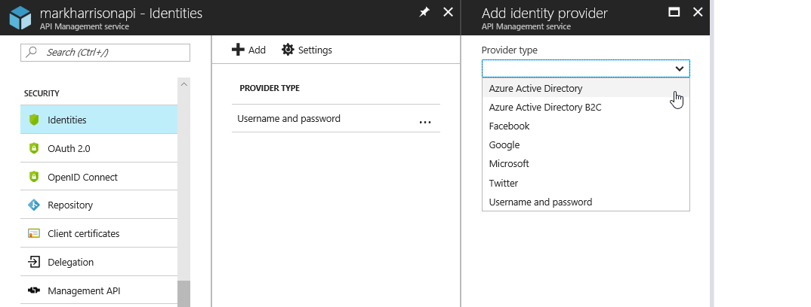

Set up federation - optional (needs access to an identity provider / approprate permissions).

Example, for Azure AD

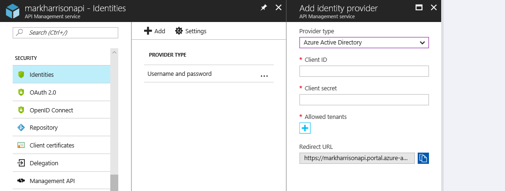

- Config API Management to federate with Azure AD
  - Make note of Return URL
- Config Azure AD
  - Create APP - specify the Return URL

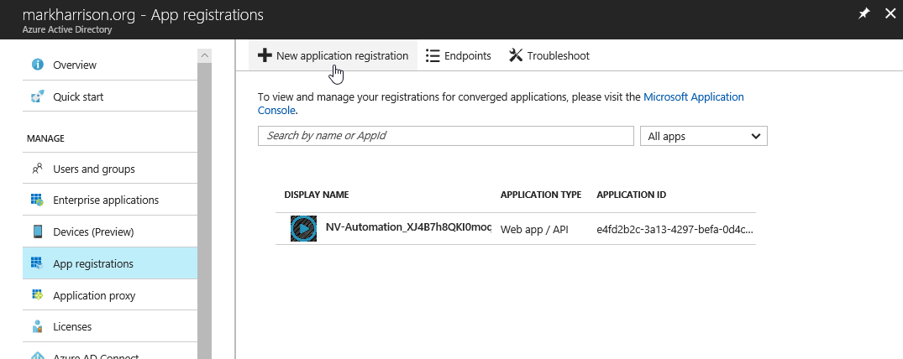

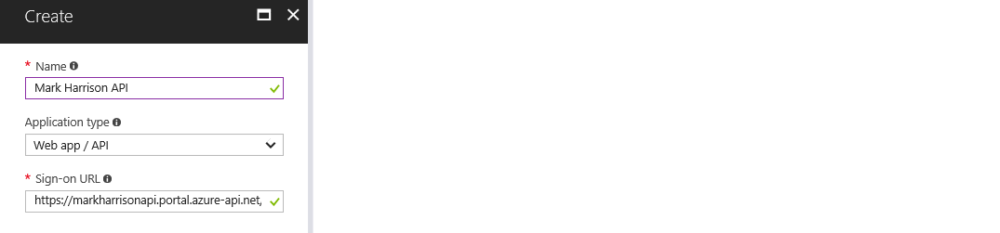

- Get App registration information
  - Make note of Application Id
  - Create a Key - make a note of it

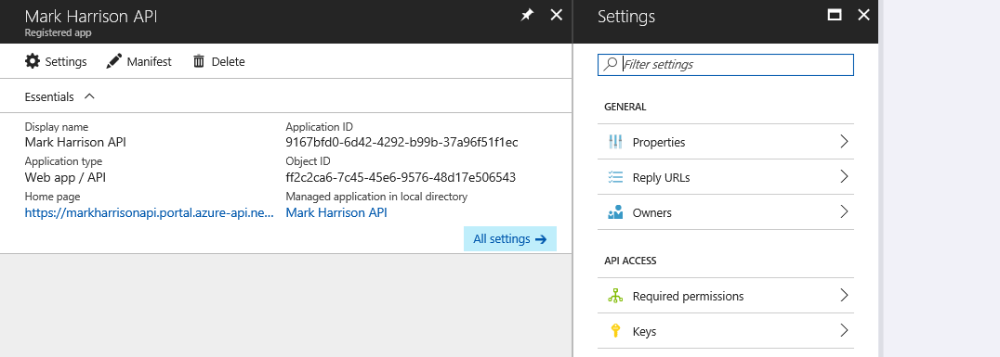

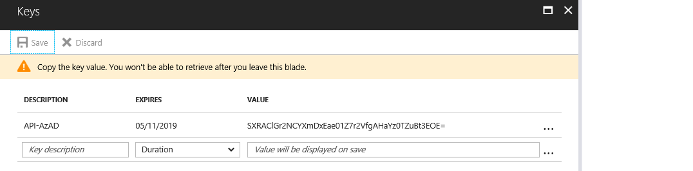

- Return to the Add Identity Provider blade
  - Enter the Application Id and Key
  - Enter the AD tenants that you want to federate with

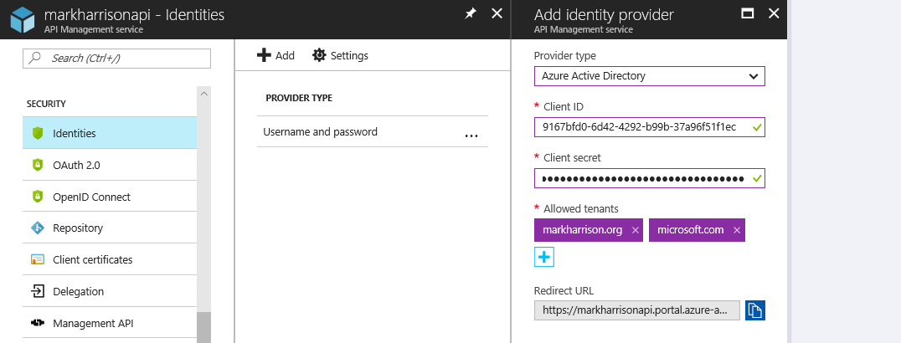

- Return to Developer portal and notice the federation option now appears at the bottom
  - Create an account with a user from Azure AD
  - Sign in with an Azure AD account

#### API authentication

Users need a key to successfully invoke the API

- The keys for the subscribed products can be seen in the Profile screen
- The Unlimited subscription is now active (we approved the request)

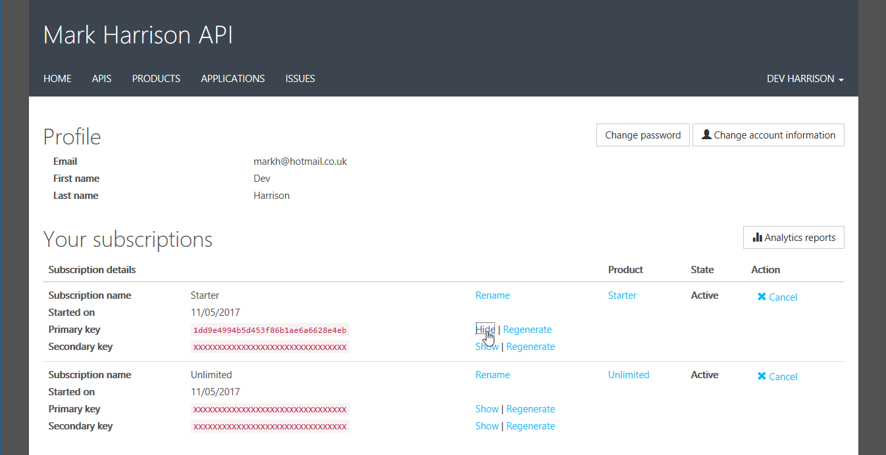

Also support for OAuth2 & OpenId Connect

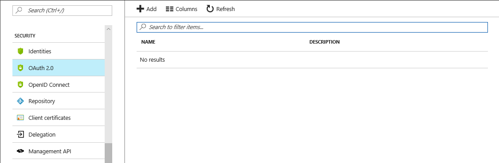

Support for JSON Web Token (JWT) - see cover later

Client certificates can be uploaded, and used to authenticate API Management with the backend API infrastructure

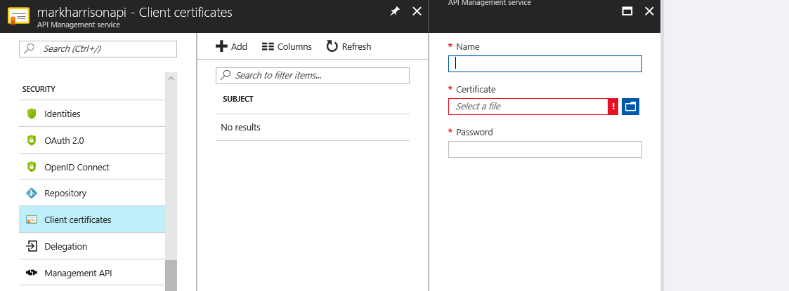

### Service Management

Each API Management service instance maintains a configuration database that contains information about the configuration and metadata for the service instance.

#### Scripting

Changes can be made to the service instance by changing a setting in the publisher portal, using a PowerShell cmdlet, or making a REST API call.

- Look at the management REST API.  This is off by default and needs to be enabled, if required.

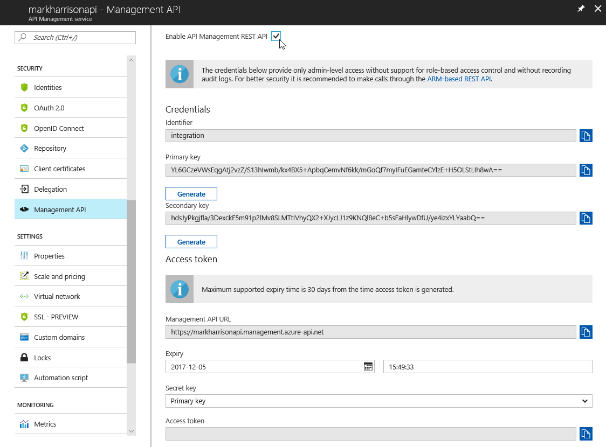

#### Global deployment

Premium tier supports multi-region deployment which enables API publishers to distribute a single API Management service across any number of desired Azure regions.

Uses Traffic Manager 'performance routing' methods.

- This is not available in the Developer tier.

<https://docs.microsoft.com/en-us/azure/api-management/api-management-howto-deploy-multi-region>

#### Lifecycle

Changes can be made to the service instance by changing a setting in the publisher portal, using a PowerShell cmdlet, or making a REST API call.

Can also manage your service instance configuration using Git, enabling service management scenarios such as Configuration versioning, Bulk configuration changes and Familiar Git toolchain and workflow.

- Look at Git configuration
  - Generate password
  - Save to Repository

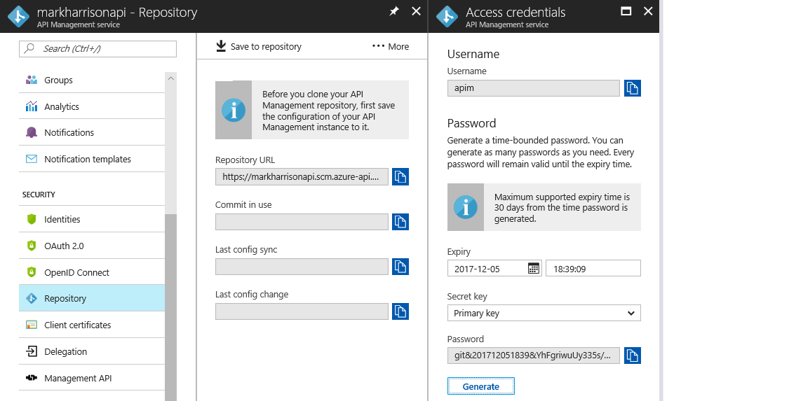

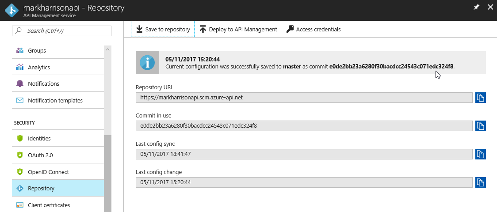

- Pull to local machine

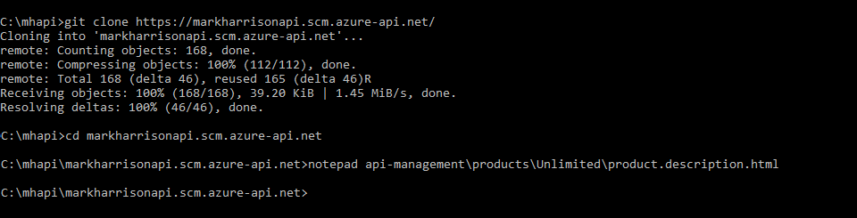

- Make change to a Product description

- Push back to the API Management repository

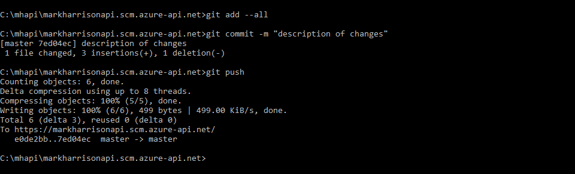

- Select [Deploy to API Management] in the Repository blade - specify master branch

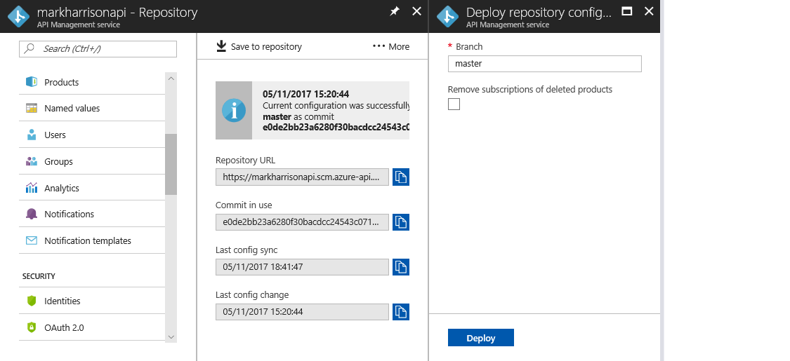

- See update in Developer portal

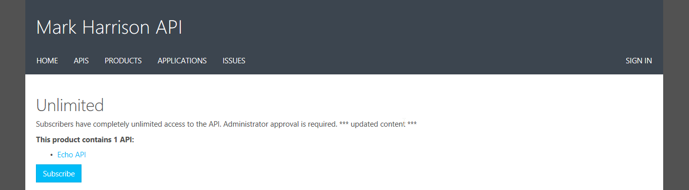

#### Networking

Azure API Management can be deployed inside the virtual network (VNET), so it can access backend services within the network. The developer portal and API gateway, can be configured to be accessible either from the Internet or only within the virtual network.

<https://docs.microsoft.com/en-us/azure/api-management/api-management-using-with-vnet>

VNET connectivity is available in the Premium and Developer tiers only.

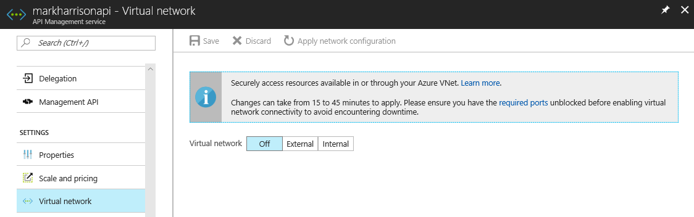

#### Scale

Customers can scale an API Management instance by adding and removing units. A unit has a certain load-bearing capacity expressed as a number of API calls per month and volume of data transfer.  Capacity and price of each unit depends on a tier in which the unit exists. You can choose between three tiers: Developer, Standard, Premium.

The price of each unit, the ability to add/remove units, whether or not you have certain features (for example, multi-region deployment) depends on the tier that you chose for your API Management instance.  Standard and Premium are production tiers have SLA and can be scaled. The Standard tier can be scaled to up to four units. You can add any number of units to the Premium tier.

<https://azure.microsoft.com/en-gb/pricing/details/api-management/>

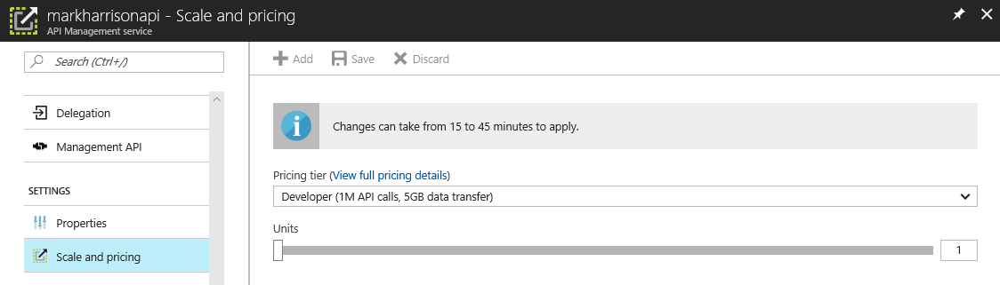

### Product Management

A product contains one or more APIs as well as a usage quota and the terms of use. Once a product is published, developers can subscribe to the product and begin to use the product's APIs.

#### Product definition

- Look at existing products

- Add new product - for example a Gold tier
  - Assign products | set Visibility | Publish

- See the new product in the Developer portal

#### Policies

- Look at policy for Starter product
- Notice the rate limits / quota constraints
- Policies can be at the Product level, API level or Operation Level
  - Later will drill deeper into API policy expressions

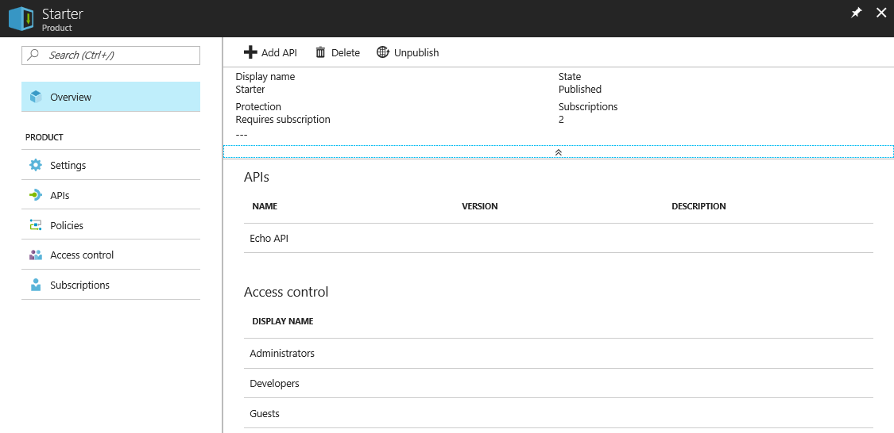

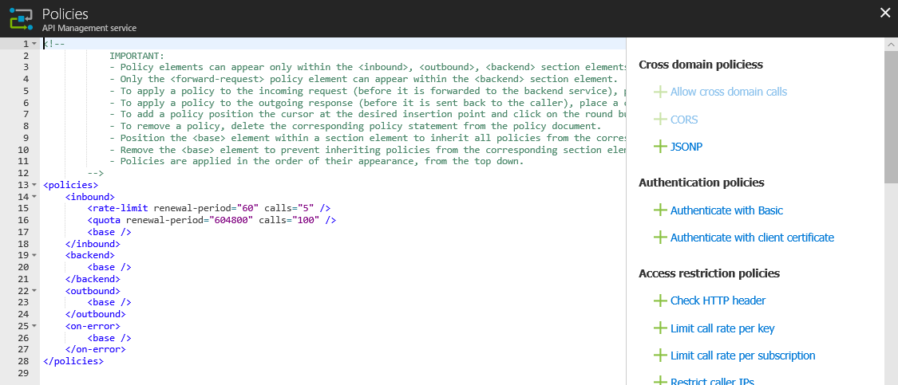

### API Management

An API represents a set of operations that can be invoked. New APIs are defined and then the desired operations are added. An API is added to a product and can be published; it may then be subscribed to and used by developers.

#### APIs

- Look at the API blade
  - List of APIs under management
  - Options for adding new APIs

#### Add API from scratch

This will use the Start Wars API <http://swapi.co>

- Select [Add Blank API]
  - Enter name and description
  - Set API URL suffice to sw
  - Assign Products

- Select [Start Wars API]

- Add Operation
  - GET /people/  ... use lowercase
  - GET /people/{id}/  ... use lowercase

- Select [Start Wars API] in Developer Portal

- Try the "GetPeople"
- Try the "GetPeopleById" ... with id = 2

- Examine Response and more detailed Trace information
  - Response 200 successful
  - Information about C-3PO in the Response Body Payload.

#### Import API using swagger

The OpenAPI specification (aka Swagger) is a definition format to describe RESTful APIs. The specification creates a RESTful interface for easily developing and consuming an API by effectively mapping all the resources and operations associated with it.

<https://www.openapis.org/>

<https://swagger.io>

- Calc API
  - <http://calcapi.cloudapp.net/>

- Goto API blade and select [Add OpenAPI Specification]
- Import swagger <http://calcapi.cloudapp.net/calcapi.json>
  - Use `calc` in URL for API

- Look at Calculator API in dev portal
  - Try the Add Two Integers operation
- Look at Response / Trace

- Colors API
  - <http://markcolorapi.azurewebsites.net/swagger/>

- Import swagger from > <http://markcolorapi.azurewebsites.net/swagger/v1/swagger.json>
  - Use `color` in URL for API

The swagger file did not contain the name of the host so need to update

- Select [Settings]
- Amend Web Service URL to `https://markcolorapi.azurewebsites.net`

- Look at Color API in dev portal
  - Try the RandomColor operation
- Look at Response / Trace

#### Rate limit

Use website <http://markcolorweb.azurewebsites.net> - this displays 500 lights.  Each light will at random intervals make a call to the RandomColor API - and then display the color returned.

There is a configution page to specify the API endpoint

- Open Developer portal and get API keys for Starter and Unlimited products
- Open Notepad - make note of URLs
  - <https://markharrisonapi.azure-api.net/color/api/RandomColor?key=> *Starter-Key*
  - <https://markharrisonapi.azure-api.net/color/api/RandomColor?key=> *Unlimited-Key*

- To see that Unlimited product has no rate limits
  - Configure Color Website to use Unlimited URL
  - Select [Start]
  - Notice there is no Rate Limit - every light is randomly updated

- To see that Starter product is limited to 5 calls per minute
  - Configure Color Website to use Starter URL
  - Select [Start]
  - Notice that only 5 lights get coloured
- Try URL with the Starter key, directly in the web browser address bar
  - Notice the error status / message returned
  - Example: *{ "statusCode": 429, "message": "Rate limit is exceeded. Try again in 54 seconds." }*

#### Caching

API Management can be configured for response caching - this can significantly reduce API latency, bandwidth consumption, and web service load for data that does not change frequently.

- Using the original Publisher portal - set a caching on the RandomColor API call
  - Set a caching duraction of 15 seconds
  - Simple caching configuration is not yet implemented in the Azure Management portal - we see shall see later how it can be done using policy expressions

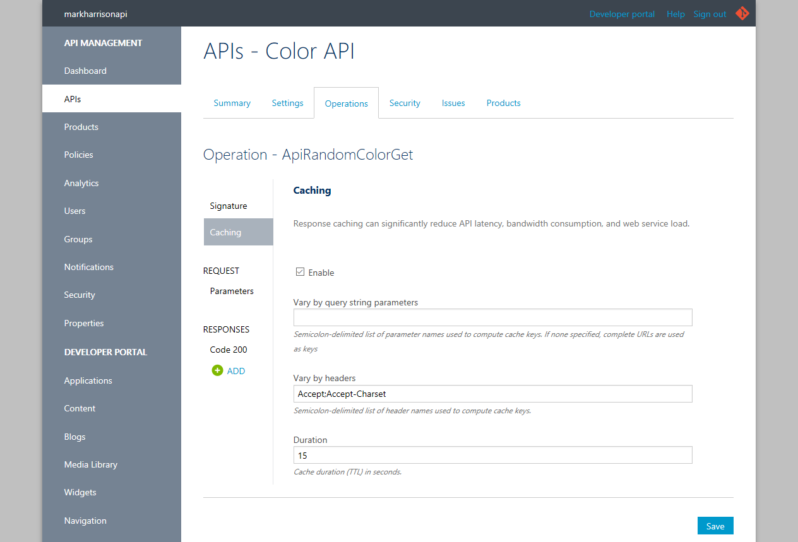

- Configure Color Website to use Unlimited URL
- Select [Start]
- Notice that for each 15 seconds period - the same color is set

#### Analytics

Analytics is currently only avaialable from the original Publisher portal.

- Look at dashboard and detailed :  Usage | Health | Activity

- Information on advanced Power BI reporting :
  - <https://blogs.msdn.microsoft.com/apimanagement/2017/09/27/power-bi-solution-template/>

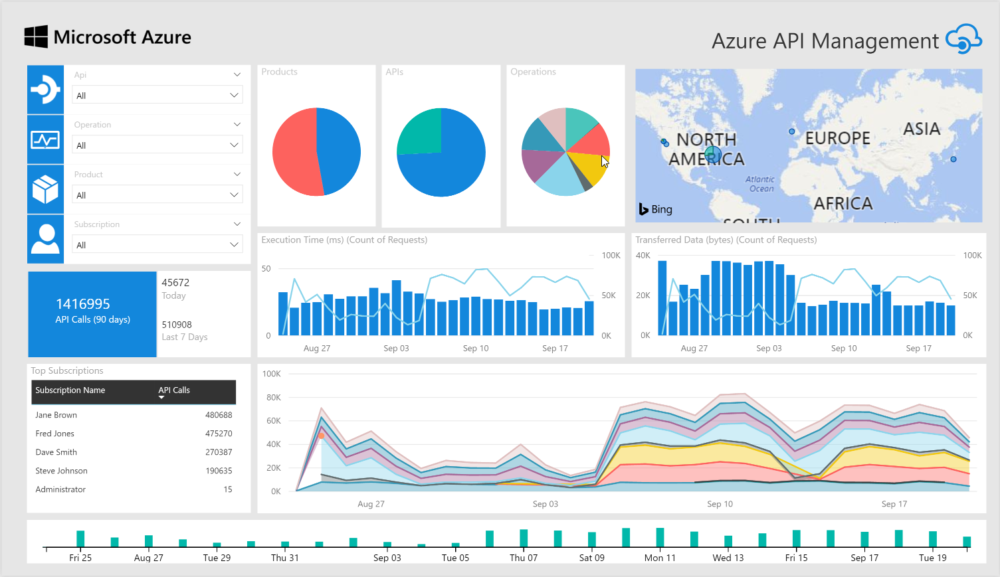

---
[Home](apimanagement-0.md) | [Prev](apimanagement-2.md) | [Next](apimanagement-4.md)