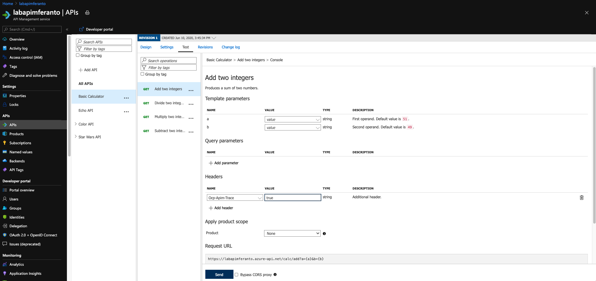

# API Management - Hands-on Lab Script - part 4

Mark Harrison : checked & updated 10 March 2020 - original 1 Nov 2017


- [Part 1 - Create an API Management instance](apimanagement-1.md)
- [Part 2 - Developer Portal](apimanagement-2.md)
- [Part 3 - Administration](apimanagement-3.md)
- [Part 4 - Policy Expressions](apimanagement-4.md) ... this document
- [Part 5 - API Proxy to other Azure services](apimanagement-5.md)

## Policy Expressions

Policy Expressions are used to control traffic to and modify the behavior of the Backend API. Using C# statements and an ability to access the API context, as well as your API Management service configuration, Policy Expressions are a powerful way to modify the behavior of the API at runtime.

<https://docs.microsoft.com/en-us/azure/api-management/api-management-policies>

We had a brief look earlier at setting CORS policies and caching.  Lets dive in a bit deeper.

### Configuration

- Select an API e.g. Color API
- Notice you can configure the Frontend, Inbound processing, Outbound processing, Backend
  - Just select the Pencil icon to edit
- Also notice, the configuration can be scoped to the API or an individual Operation


- Edit the Frontend ...
  - If editing an Operation - this gives a choice of the 'Code View' editor or Forms-based editor
  - If editing an API - the only option is the 'Code View' editor
  - The 'Code View' editor allows amendments to the Swagger (OpenAPI) definition


- Edit Inbound processing / Outbound processong / Backend
  - Have a choice of the 'Code View' editor or selecting an [Add Policy] Form


### Examples

#### HTTP Response Caching

- Look at RandomColor API
- Switch to 'Code View'
  - See the caching policies (set from earlier)

```xml
<!-- Inbound -->
  <cache-lookup vary-by-developer="false"
      vary-by-developer-groups="false"
      downstream-caching-type="none" />

<!-- Outbound -->
<cache-store duration="15" />
```

#### Transformation - XML to JSON

Frequent requirement is to transform content

- Remember the Calc API ... this returned XML
- Open the Calculator API 'Code View'
- Add the outbound policy to transform response body to JSON
- Invoke the API and examine the response - note that its now JSON

```xml
<!-- Outbound -->
<xml-to-json kind="direct" apply="always" consider-accept-header="false" />
```


#### Named Values collection

Named Values (aka Properties) are a collection of key/value pairs that are global to the service instance. These properties can be used to manage constant string values across all API configuration and policies.  Values can be expressions or secrets (never displayed).

- Set a property called `TimeNow`
  - e.g. `@(DateTime.Now.ToString())`


- Open the Calculator API 'Code View'
- Add the inbound policy to add the header
- Test the API within the Azure Management portal
  - Add a Header called [Ocp-Apim-Trace] set to true
  - Examine the response and the [Trace] tab

```xml
<!-- Inbound -->
<set-header name="timeheader" exists-action="override">
    <value>{{TimeNow}}</value>
</set-header>
```




- Go to the URL specified in the HTTP Response - [ocp-apim-trace-location]
  - Note that the [timeheader] field has been sent to the backend API


#### Delete response headers

Frequent requirement is to remove headers - example those that might leak potential security information

- Open the Calculator API 'Code View'
- Add the outbound policy to delete the response headers
- Invoke the API and examine the response

```xml
<!-- Outbound -->
<set-header name="x-aspnet-version" exists-action="delete" />
<set-header name="x-powered-by" exists-action="delete" />
```

Before:


After policy applied:


#### Amend what's passed to the backend

Policy expressions can include C# code. Can access a number of .NET Framework types and their members .NET Framework type.  A variable named `context` is implicitly available and its members provide information pertinent to the API request.

More info <https://docs.microsoft.com/en-us/azure/api-management/api-management-policy-expressions>

- Open the Calculator API 'Code View'
- Add the inbound policy to amend the query string and header
- Invoke the API - use the Trace function to examine what was passed to backend

```xml
<!-- Inbound -->
<set-query-parameter name="x-product-name" exists-action="override">
    <value>@(context.Product.Name)</value>
</set-query-parameter>
<set-header name="x-request-context-data" exists-action="override">
    <value>@(context.User.Id)</value>
    <value>@(context.Deployment.Region)</value>
</set-header>
```

Note - this trace below was from the Developer portal.  I got errors when testing from the Azure Management portal, as the [User Id] is unable to be evaluated.


#### Transformation - conditional

Another C# example to manipulate the response body, depending on the product - with this expression a subscriber of the Starter product will only get back a subset of the information.  Other products will get the full information.

- Open the Star Wars API | GetPeopleById operation 'Code View'
- Add the outbound policy to conditionally change the response body
- Invoke the API using the Starter product key and examine the response
- Invoke the API using the Unlimited product key and examine the response

Not the inbound header is set to ensure that the Response Body is not encoded as that causes the JSON parsing to fail.

```xml
<!-- Inbound -->
        <set-header name="Accept-Encoding" exists-action="override">
            <value>deflate</value>
        </set-header>
<!-- Outbound -->
<choose>
    <when condition="@(context.Response.StatusCode == 200 && context.Product.Name.Equals("Starter"))">
        <set-body>@{
                var response = context.Response.Body.As<JObject>();
                foreach (var key in new [] {"hair_color", "skin_color", "eye_color", "gender"}) {
                    response.Property(key).Remove();
                }
                return response.ToString();
            }
        </set-body>
    </when>
</choose>

```

With Starter key:


With Unlimited key:


#### JSON Web Tokens (JWT) - validate

JSON Web Tokens are an open, industry standard method for representing claims securely between two parties. More info at <https://jwt.io/>

- Use the following sites
  - <https://jwt.io/> to create a JWT
    - Use a key that matches the value in the policy expression e.g. 123412341234123412341234
  - <https://www.unixtimestamp.com/index.php>
    - i.e. 01/01/2020  = 1577836800


- Open the Calculator API 'Code View'
- Add the inbound policy to validate that JWT is valid
  - Example shows the use of variables in an expression - useful if a value is repeated

```xml
<!-- Inbound -->
<set-variable name="signingKey" value="123412341234123412341234" />
<validate-jwt header-name="Authorization" failed-validation-httpcode="401" failed-validation-error-message="Unauthorized">
    <issuer-signing-keys>
        <key>@((string)context.Variables["signingKey"])</key>
    </issuer-signing-keys>
</validate-jwt>

```

- Invoke the API ... should get a [401 Unauthorized error]
- Invoke the API with a request header containing the security token (got above from <https://jwt.io/>) ... should get a 200 success
  - Name: Authorization
  - Value: bearer `JWT token`  (space between bearer and token)

No JWT:


Valid JWT in header:

Note the bearer token in the Request payload.
Make sure your JWT token has an expiry date in the future.


#### JSON Web Tokens (JWT) - check a claim exists

- Open the Calculator API 'Code View'
- Add the inbound policy to validate that JWT is valid and that the claim 'admin' exists
- Invoke the API - with Authorization header as above ... should get a 200 success
- Amend the policy with a claim name that doesnt exist e.g. 'adminx'
- Invoke the API - with Authorization header as above ... should get a 401 Unauthorized error

```xml
<!-- Inbound -->
        <set-variable name="signingKey" value="123412341234123412341234" />
        <validate-jwt header-name="Authorization" failed-validation-httpcode="401" failed-validation-error-message="Unauthorized">
            <issuer-signing-keys>
                <key>@((string)context.Variables["signingKey"])</key>
            </issuer-signing-keys>
            <required-claims>
                <claim name="admin" match="any">
                    <value>true</value>
                </claim>
            </required-claims>
        </validate-jwt>
```

Checking for admin claim:


Checking for adminx claim:

```xml
                <claim name="adminx" match="any">
```


#### JSON Web Tokens (JWT) - extract claim and pass to backend

- Open the Calculator API 'Code View'
- Add the inbound policy to:
  - validate the JWT (as above)
  - extract the 'name' claim and set in header (below)
- Invoke the API - with Authorization header as above ... should get a 200 success
- Use the Trace feature to inspect what was passed to backend ... should see the use name from JWT

```xml
<!-- Inbound -->
<set-header exists-action="override" name="username">
    <value>@{
        Jwt jwt;
        context.Request.Headers.GetValueOrDefault("Authorization","scheme param")
                            .Split(' ').Last().TryParseJwt(out jwt);
        return jwt.Claims.GetValueOrDefault("name", "?");
        }
    </value>
</set-header>
```


#### Aborting the processing

- Open the Calculator API 'Code View'
- Add the inbound policy to test for a condition and return error
- Invoke the API - with Authorization header as above ... should get a 599 error
- Replace the condition with some more meaningful code

```xml
<!-- Inbound -->
<choose>
    <when condition="@(true)">
        <return-response response-variable-name="existing response variable">
            <set-status code="599" reason="failure" />
            <set-header name="failure" exists-action="override">
                <value>failure</value>
            </set-header>
            <set-body>blah</set-body>
        </return-response>
    </when>
</choose>
```


#### Send message to Microsoft Teams channel

Alternatively use Slack

This example shows 'Send one way request' ... sends a request to the specified URL without waiting for a response.  Another option is to Send request and Wait.  Complex in flight processing logic is better handled by using Logic Apps.

For Microsoft Teams

- First need to go into Teams and enable a Web hook connector.
  - Get the URL of the webhook.


- Format the required payload ... the payload sent to a Teams channel is of the MessageCard JSON schema format
  - <https://docs.microsoft.com/en-us/microsoftteams/platform/task-modules-and-cards/cards/cards-reference>
  - <https://messagecardplayground.azurewebsites.net/>

- Open the Calculator API 'Code View'
- Add the outbound policy
  - replace the webhook and payload as required

```xml
<!-- Outbound -->
<choose>
    <when condition="@(context.Response.StatusCode >= 299)">
        <send-one-way-request mode="new">
            <set-url>https://outlook.office.com/webhook/78f54a63-f217-451a-b263-f1f5c0e866f0@72f988bf-86f1-41af-91ab-2d7cd011db47/IncomingWebh00k/34228a8ccbe94e368d3ac4782adda9b2/4e01c743-d419-49b7-88c6-245e5e31664a</set-url>
            <set-method>POST</set-method>
            <set-body>@{
                    return new JObject(
                        new JProperty("@type","MessageCard"),
                        new JProperty("@context", "http://schema.org/extensions"),
                        new JProperty("summary","Summary"),
                        new JProperty("themeColor", "0075FF"),
                        new JProperty("sections",
                            new JArray (
                                new JObject (
                                    new JProperty("text","Error - details: [link](http://azure1.org)")
                                    )
                                )
                            )
                        ).ToString();
            }</set-body>
        </send-one-way-request>
    </when>
</choose>

```

- for demo purposes, amend the condition so it always fires i.e. `StatusCode = 200`
- Invoke the API ... should get a 200 success
- Look for a message in the Teams channel

```xml
    <when condition="@(context.Response.StatusCode == 200)">
```

Received notification in the Teams channel:


#### Send to Azure Event Hub

Using the log-to-eventhub policy enables sending any details from the request and response to an Azure Event Hub. Usage examples include audit trail of updates, usage analytics, logging, monitoring, billing, exception alerting and 3rd party integrations.

The Azure Event Hubs is designed to ingress huge volumes of data, with capacity for dealing with a far higher number of events. This ensures that your API performance will not suffer due to the logging infrastructure.

<https://docs.microsoft.com/en-us/azure/api-management/api-management-log-to-eventhub-sample>

#### Cross-origin resource sharing (CORS)

The cors policy adds cross-origin resource sharing (CORS) support to an operation or an API to allow cross-domain calls from browser-based clients.

<https://docs.microsoft.com/en-us/azure/api-management/api-management-cross-domain-policies#CORS>

```xml
<!-- Inbound -->
    <cors>
        <allowed-origins>
            <origin>*</origin>
        </allowed-origins>
        <allowed-methods>
            <method>GET</method>
            <method>POST</method>
            <method>PUT</method>
            <method>DELETE</method>
            <method>HEAD</method>
            <method>OPTIONS</method>
            <method>PATCH</method>
            <method>TRACE</method>
        </allowed-methods>
        <allowed-headers>
            <header>*</header>
        </allowed-headers>
        <expose-headers>
            <header>*</header>
        </expose-headers>
    </cors>
```

#### Mock responses

Mocking provides a way to return sample responses even when the backend is not available. This enables app developers to not be help up if the backend is under development.

- Open the Star Wars API and select [Add Operation]
- Create a new operation called GetFilm
- In the Response configuration tab, set Sample data as below


```json
{
  "count": 1,
  "films": [   { "title": "A New Hope",  "blah": "xxx"    }   ]
}
```

- Open the Inbound processing 'Code View'
- Enable mocking and specify a 200 OK response status code


- Select the 200 OK response ... Save


- Mocking is now enabled


- Invoke the API ... should get a 200 success with the mocked data


---
[Home](apimanagement-0.md) | [Prev](apimanagement-3.md) | [Next](apimanagement-5.md)
