# API Management - Hands-on Lab Script - part 5

Mark Harrison : 1 Nov 2017


- [Part 1 - Create an API Management instance](apimanagement-1.md)
- [Part 2 - Developer Portal](apimanagement-2.md)
- [Part 3 - Administration](apimanagement-3.md)
- [Part 4 - Policy Expressions](apimanagement-4.md)
- [Part 5 - API Proxy to other Azure services](apimanagement-5.md) ... this document

## API Proxy to other Azure services

### Azure Functions

- Create a simple function that is Triggered by an HTTP Request

Example:


```c#
    string[] strColors = { "blue", "lightblue", "darkblue" };
//  string[] strColors = { "green", "lightgreen", "darkgreen" };

    Random r = new Random();
    int rInt = r.Next(strColors.Length);

    return req.CreateResponse(HttpStatusCode.OK, strColors[rInt]);
```


Need to generate a OpenAPI (Swagger) definition file

- Select the [Integrate] tab of the function
- Change [Allowed HTTP Methods] field to [Select Methods]
- Change [Selected HTTP methods] to just allow GET
- For Demo purpose - turn off authentication ... Change [Authorization level] to [Anonymous]

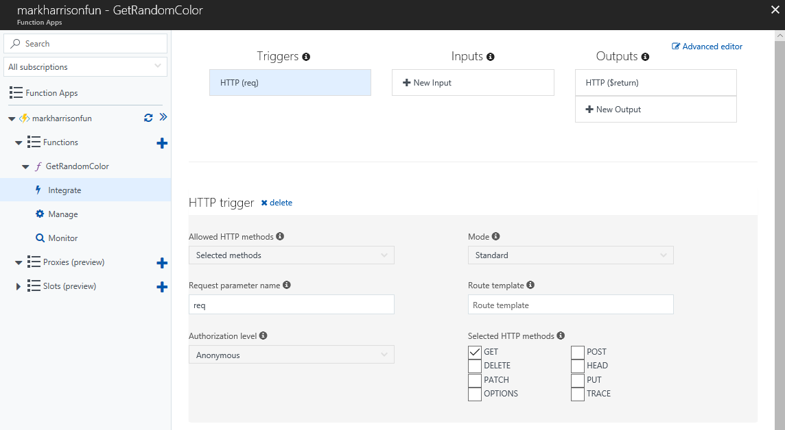

- Go to Platform Fetaures and select [API definition]

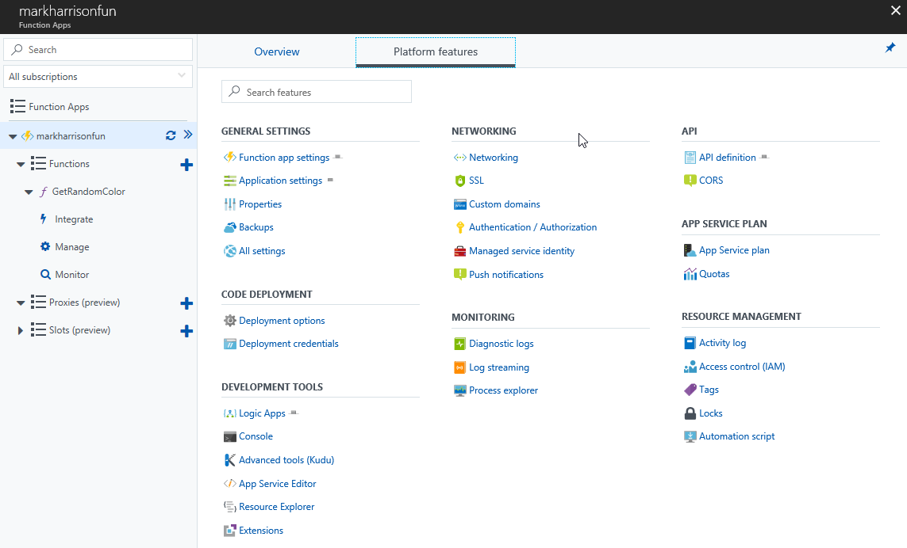

- On the API definition source, select [Function]
- Then select [Generate API definition template]

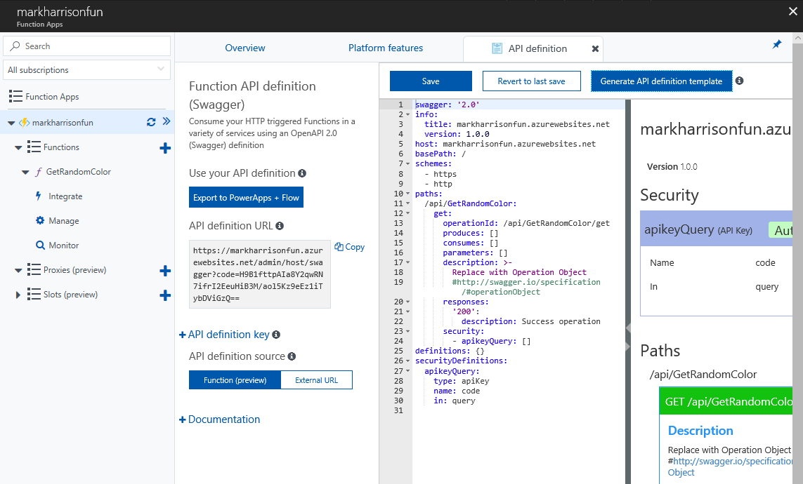

- Whilst in Platform Features, set CORS to allow access from anywhere
  - This is needed later, so we can invoke the function from a Logic App.  Also means we can use it from the Color Website we used earlier

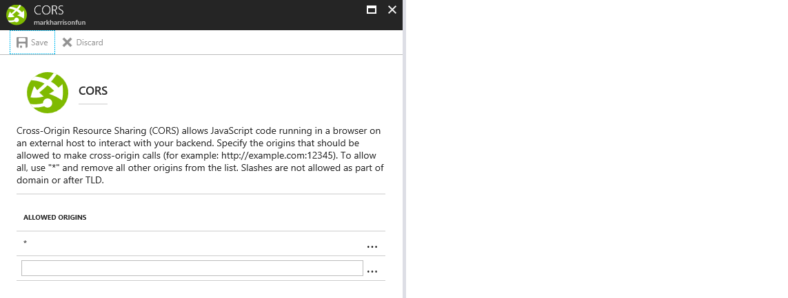

- Return to the API blade in API Management
- Add a new API - select [Functions App]
- Use the [Browser] button to see list of available Ffunctions within the subscription

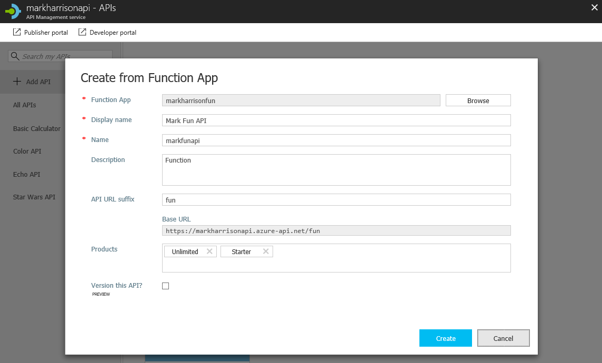

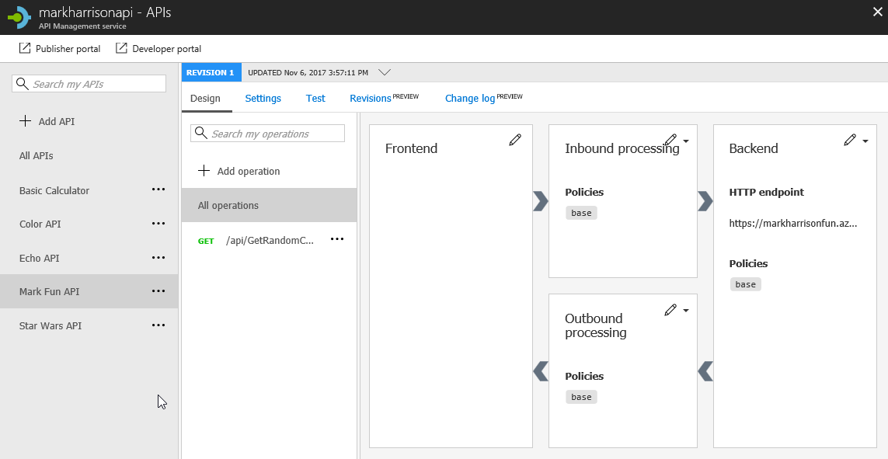

- Invoke the API ... should get a 200 success

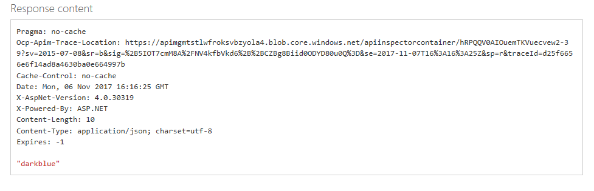

### Azure Logic Apps

- Create a simple logic app that is Triggered by an HTTP Request

Example:


Use the following sample message to generate the schema of the Request body payload.  By specifying the schema, the individual fields (in this case `msg`) can be extracted and referred to in the subsequent logic

```json
{
  "msg": "text"
}
```

- Return to the API blade in API Management
- Add a new API - select [Logic Apps]
- Use the [Browser] button to see list of available Logic Apps within the subscription

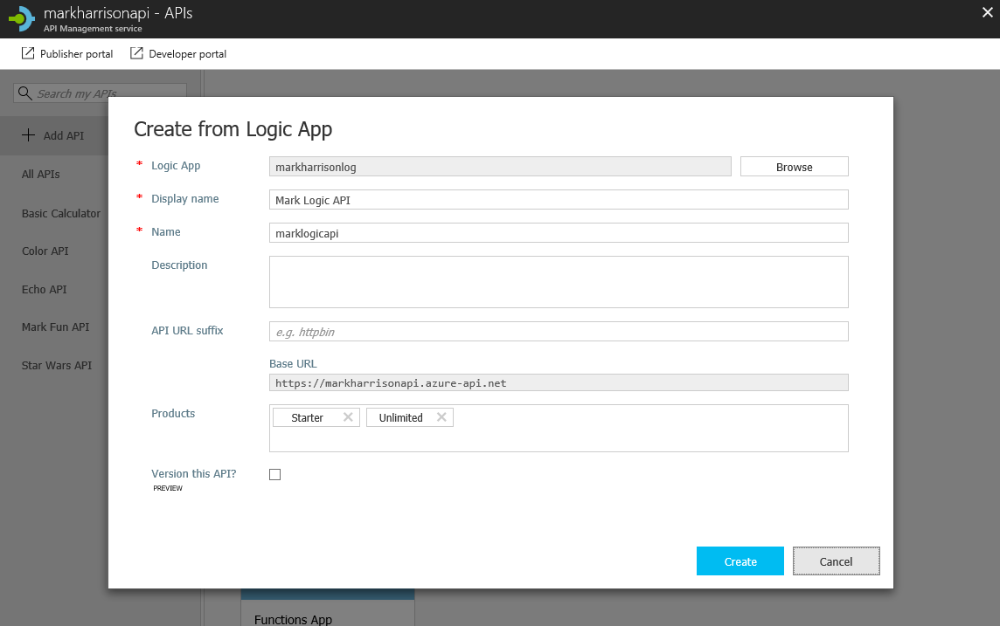

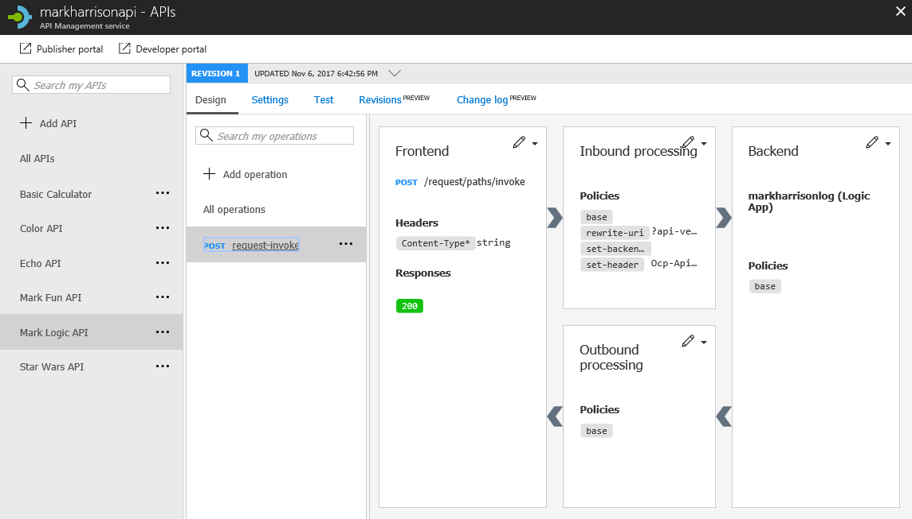

- Invoke the API ... should get a 200 success
  - Set the message in the payload to conform to the JSON schema
  - Ensure `Content-Type` is set to `application/json`

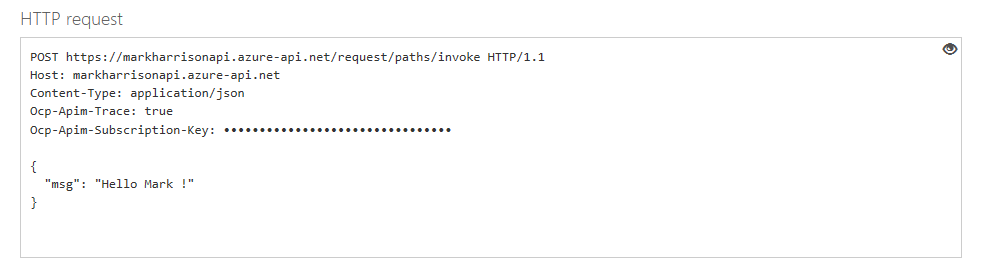

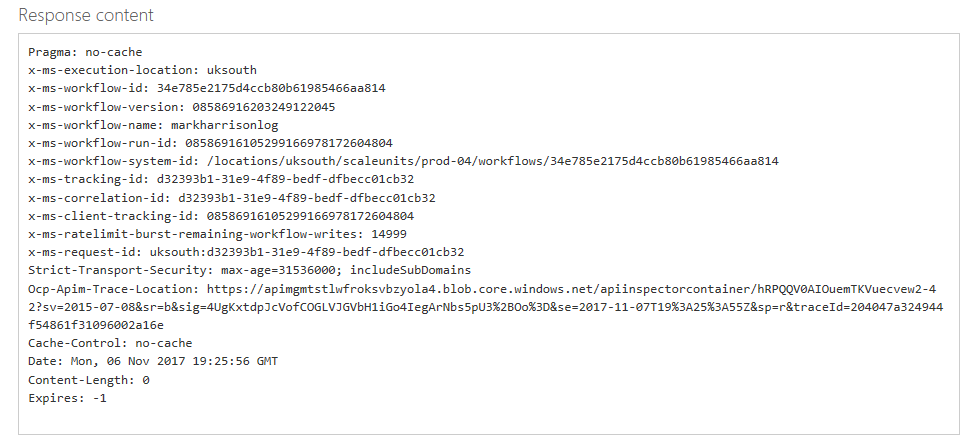

- Check for generated email


---
[Home](apimanagement-0.md) | [Prev](apimanagement-4.md)  