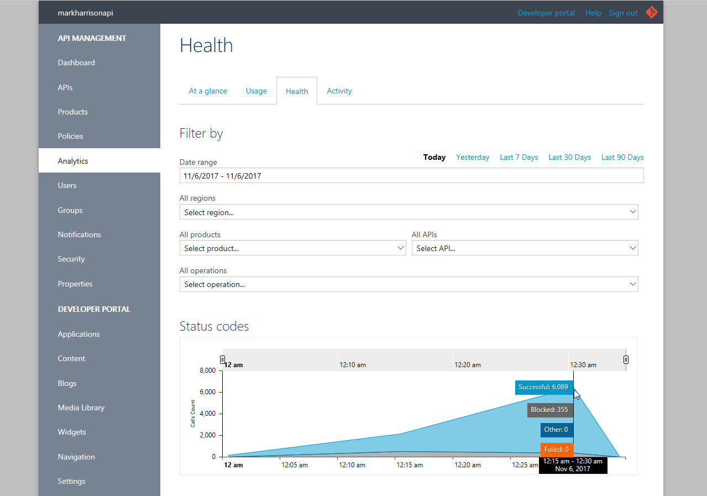

# API Management - Hands-on Lab Script - part 6

- [Part 1 - Create an API Management instance](apimanagement-1.md) 
- [Part 2 - Developer Portal and Product Management](apimanagement-2.md) 
- [Part 3 - Adding API's](apimanagement-3.md) 
- [Part 4 - Caching and Policy Expressions](apimanagement-4.md) 
- [Part 5 - Versioning and Revisions](apimanagement-5.md) 
- [Part 6 - Analytics and Monitoring](apimanagement-6.md) ... this document
- [Part 7 - Security](apimanagement-7.md)
- [Part 8 - DevOps](apimanagement-8.md)

#### Analytics

Analytics is available in the Azure management portal from the Analyics blade.

- Look at dashboard and detailed :  Timeline | Geography | APIs | Operations | Products | Subscriptions | Users | Requests

---
[Home](README.md) | [Prev](apimanagement-5.md) | [Next](apimanagement-7.md)