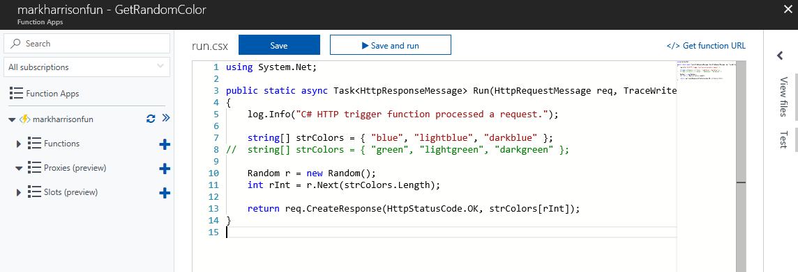
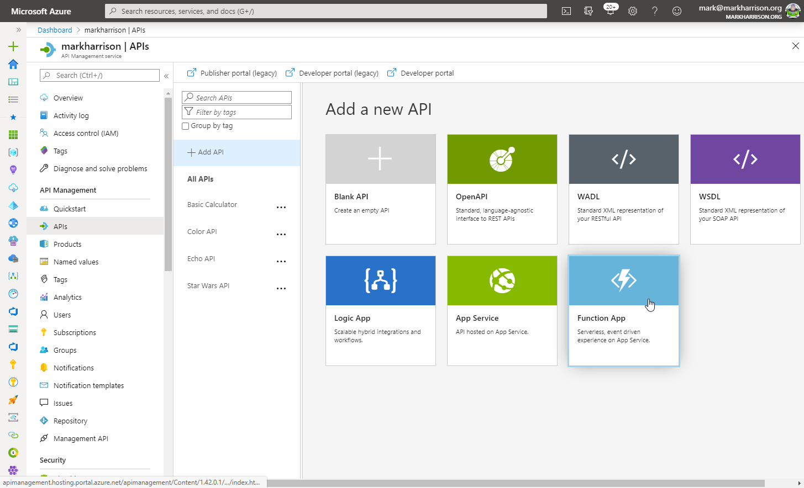
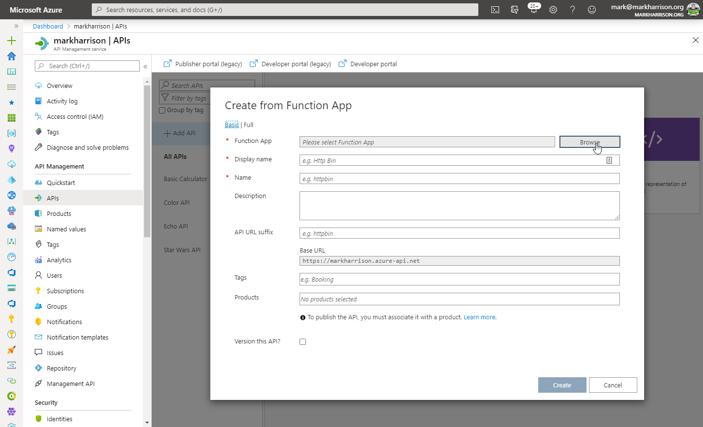
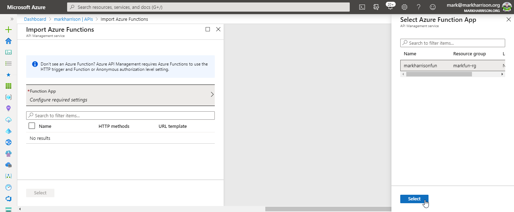
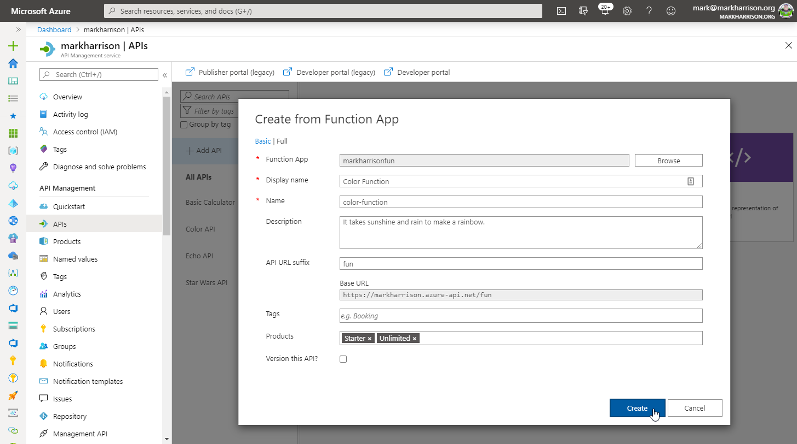
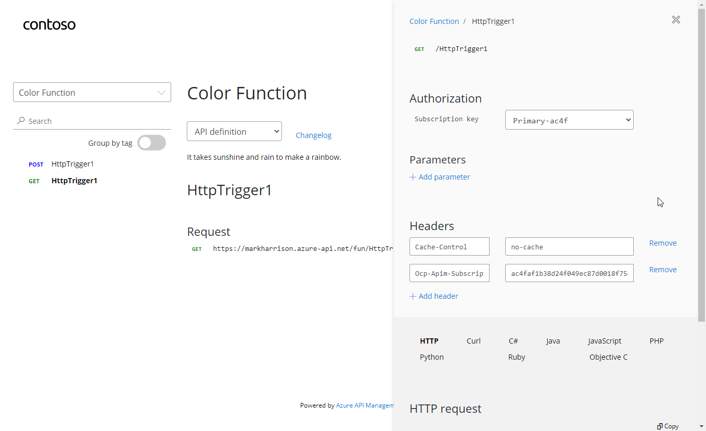
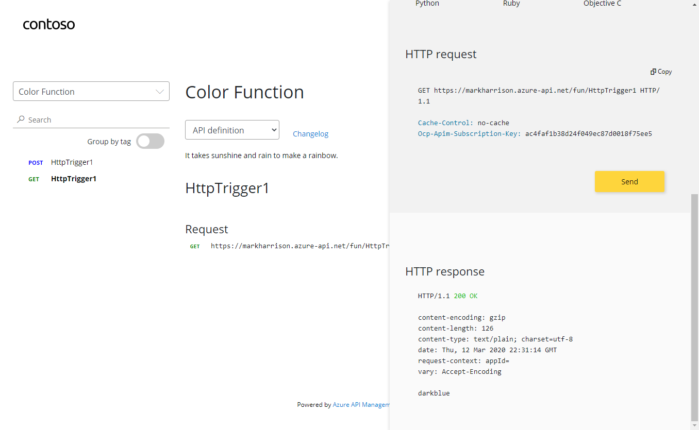
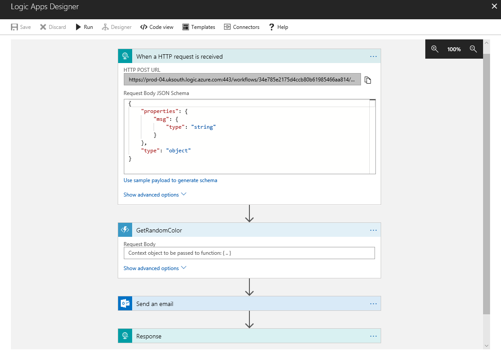
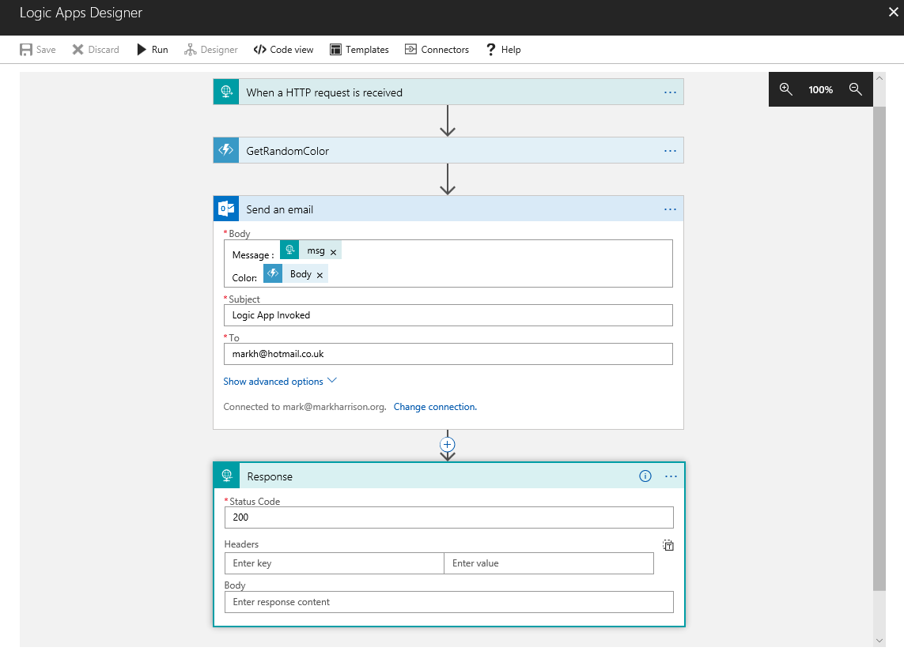

# API Management - Hands-on Lab Script - part 5

Mark Harrison : checked & updated 12 March 2020 - original 1 Nov 2017


- [Part 1 - Create an API Management instance](apimanagement-1.md)
- [Part 2 - Developer Portal](apimanagement-2.md)
- [Part 3 - Administration](apimanagement-3.md)
- [Part 4 - Policy Expressions](apimanagement-4.md)
- [Part 5 - API Proxy to other Azure services](apimanagement-5.md) ... this document

## API Proxy to other Azure services

### Azure Functions

- Create a simple function that is Triggered by an HTTP Request

Example:



```c#
    string[] strColors = { "blue", "lightblue", "darkblue" };
//  string[] strColors = { "green", "lightgreen", "darkgreen" };

    Random r = new Random();
    int rInt = r.Next(strColors.Length);

    return req.CreateResponse(HttpStatusCode.OK, strColors[rInt]);
```

Lets add the function to API Managament.   In the API blade select [+Add API] and the [Function App] tile



- Select the [Browse] button to get a list of Functions in the subscription



- Select the function



- Amend the Names / Descriptions, URL suffix and select the Products



- As previously add CORS policy

- Validate the function works - either from the Azure management portal or the developer portal





### Azure Logic Apps

- Create a simple logic app that is Triggered by an HTTP Request

Example:





Use the following sample message to generate the schema of the Request body payload.  By specifying the schema, the individual fields (in this case `msg`) can be extracted and referred to in the subsequent logic

```json
{
  "msg": "text"
}
```

Lets add the function to API Managament. In the API blade select [+Add API] and the [Logic App] tile


- Select the [Browse] button to get a list of Logic Apps in the subscription


- Select the Logic App


- Amend the Names / Descriptions, URL suffix  and select the Products


 As previously add CORS policy

- Validate the Logic App works - either from the Azure management portal or the developer poral


- Check the Logic App audit


- Check the email was sent


---
[Home](apimanagement-0.md) | [Prev](apimanagement-4.md)
